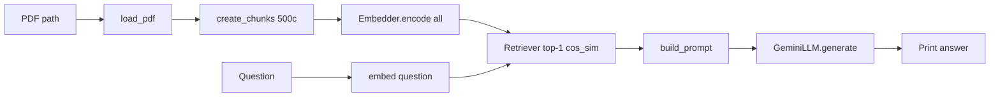
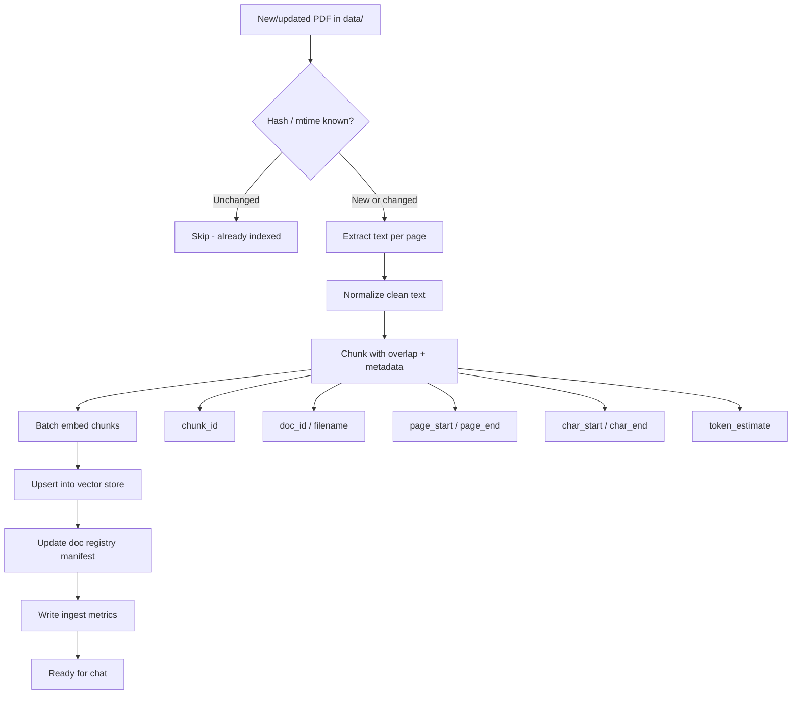
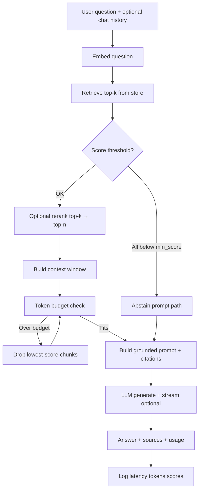
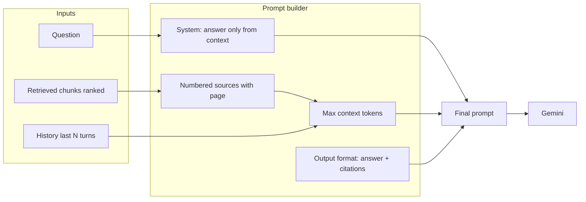
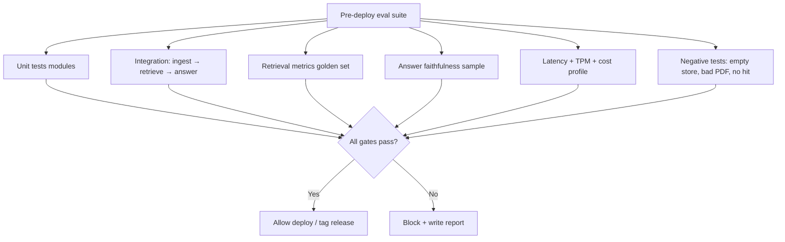

# Production PDF RAG — Blueprint

**Status:** Design / review (implementation not started)  
**Base:** `pdf_rag_v2_starter` (CLI, single PDF, top-1 retrieval)  
**Goal:** Production-like, lightweight RAG: multi-file ingest → embed → chat, with eval gates before deploy.

---

## 1. Current system (baseline)

| Area | Today | Gap |
|------|--------|-----|
| Ingest | One PDF path at run time | No multi-file, no incremental add |
| Chunking | Fixed 500 chars, no overlap | Poor boundary / recall |
| Embeddings | In-memory only | Recomputed every run; no store |
| Retrieve | Top-1 cosine | No top-k, filter, or rerank |
| Prompt | Single context blob | No token budget, weak citations |
| LLM | Gemini one-shot | No streaming, usage, or retries |
| Chat | One question | No multi-turn, no history |
| Eval | None | No latency / TPM / quality gates |
| Ops | Flat scripts | No API, health, or config layers |

### Current logic (as-is)



---

## 2. Target architecture

Keep the stack **light**: no LangChain/LlamaIndex monolith. Prefer small, swappable modules.

### 2.1 Recommended lightweight stack

| Layer | Library / choice | Why |
|-------|------------------|-----|
| PDF extract | `pypdf` (keep) or `pymupdf` optional | Fast text + page numbers |
| Chunking | Custom + optional `tiktoken` / char-overlap | Full control, no heavy deps |
| Embeddings | `sentence-transformers` → `all-MiniLM-L6-v2` (keep) | Local, free, ~80MB |
| Vector store | **Chroma** (persistent) *or* **numpy + JSON/SQLite** | Chroma = simple persist; numpy = zero extra service |
| Similarity | Cosine (existing) + top-k | Same mental model as starter |
| Rerank (optional) | Cross-encoder MiniLM *or* skip v1 | Accuracy boost if needed |
| LLM | `google-generativeai` Gemini | Already wired |
| Token accounting | `tiktoken` approximate *or* Gemini usage metadata | TPM / cost / prompt budget |
| API (optional) | FastAPI | Chat + ingest HTTP for “production-like” |
| CLI | Typer / argparse | Keep `app.py` style entry |
| Eval | Custom harness + optional `ragas` later | Avoid heavy eval deps at first |
| Tests | `pytest` + fixtures | Corner coverage |
| Metrics | `time.perf_counter`, counters, JSON reports | Latency, TPM, hit rates |

**Default recommendation for v1:** Chroma (local folder) + sentence-transformers + Gemini + custom eval. Still lightweight, production-shaped persistence.

### 2.2 Target high-level architecture

```mermaid
flowchart TB
  subgraph clients [Clients]
    CLI[CLI chat / ingest]
    API[FastAPI optional]
    UI[Streamlit/simple UI optional]
  end

  subgraph app [Application layer]
    ING[Ingest service]
    CHAT[Chat / query service]
    EVAL[Eval / benchmark service]
  end

  subgraph core [RAG core]
    LOAD[Document loader]
    CHUNK[Chunker + metadata]
    EMB[Embedder]
    VS[(Vector store persistent)]
    RET[Retriever top-k + filters]
    RER[Reranker optional]
    PRMPT[Prompt builder + token budget]
    LLM[LLM Gemini]
  end

  subgraph storage [Storage]
    DATA[data/ PDFs]
    IDX[embeddings/ or chroma/]
    META[manifest.json doc registry]
    REPORTS[eval_reports/]
  end

  CLI --> ING
  CLI --> CHAT
  CLI --> EVAL
  API --> ING
  API --> CHAT

  ING --> LOAD --> CHUNK --> EMB --> VS
  LOAD --> DATA
  VS --> IDX
  ING --> META

  CHAT --> EMB
  CHAT --> RET --> VS
  RET --> RER --> PRMPT --> LLM
  PRMPT --> META
```



---

## 3. End-to-end process flows

### 3.1 Document add / re-index (ingest)

**Requirement:** *On each file added under `data/`, embed it and make it available for chat.*



**Rules**

1. **Idempotent ingest:** content hash (SHA-256) of file; skip if unchanged.
2. **Delete + re-add:** if file removed from `data/`, delete vectors with that `doc_id`.
3. **Partial reindex:** only changed files; never full re-embed of whole corpus unless `--rebuild`.
4. **Atomic-ish update:** write new chunks then drop old chunk IDs for that doc (avoid empty retrieval mid-update when possible).

### 3.2 Chat / answer (query)



### 3.3 Prompt & context construction (answer quality)



**Prompt contract (production)**

- Answer **only** from provided context.
- If insufficient evidence → explicit abstain string.
- Cite sources as `[n]` mapped to `filename` + `page`.
- Prefer concise answers; no invented facts.
- Optional: “quote the supporting span” for hard evals.

### 3.4 Pre-deployment evaluation gate



---

## 4. Module design (target layout)

```text
pdf_rag_v2_starter/
├── app.py                    # CLI entry (ingest | chat | eval | serve)
├── config.py                 # env + defaults
├── BLUEPRINT.md              # this file
├── README.md                 # user + operator docs + flowcharts
├── requirements.txt
├── data/                     # source PDFs
├── storage/                  # NEW: persistent index + manifest
│   ├── chroma/  or  vectors.npz
│   └── manifest.json
├── eval_reports/             # NEW: JSON/MD reports
├── modules/
│   ├── pdf_loader.py         # page-aware extract
│   ├── chunker.py            # overlap, metadata, token-aware
│   ├── embedder.py           # batch embed + normalize
│   ├── vector_store.py       # NEW: persist upsert/query/delete
│   ├── retriever.py          # top-k, threshold, filters
│   ├── reranker.py           # NEW optional
│   ├── prompt_builder.py     # budget + citations
│   ├── llm.py                # generate + usage + retries
│   ├── ingest.py             # NEW: pipeline orchestrator
│   ├── chat.py               # NEW: query orchestrator
│   └── metrics.py            # NEW: timers, TPM, counters
├── eval/
│   ├── golden_set.json       # Q/A + expected docs/pages
│   ├── run_eval.py
│   └── metrics_retrieval.py  # hit@k, MRR, context precision
├── tests/
│   ├── test_chunker.py
│   ├── test_ingest.py
│   ├── test_retriever.py
│   ├── test_prompt_budget.py
│   └── test_e2e_smoke.py
└── utils/
    ├── hashing.py
    └── text_clean.py
```

### 4.1 Responsibility matrix

| Module | Inputs | Outputs | Notes |
|--------|--------|---------|-------|
| `pdf_loader` | path | pages `[{page, text}]` | Keep page boundaries |
| `chunker` | pages, size, overlap | chunks + metadata | Overlap 10–20%; never split mid-word if easy |
| `embedder` | texts[] | float vectors | L2-normalize for cosine |
| `vector_store` | upsert/query/delete | hits + scores | Persistent |
| `retriever` | query emb, k, filters | ranked chunks | min_score gate |
| `prompt_builder` | q, chunks, max_tokens | prompt string | Drop low-rank if overflow |
| `llm` | prompt | text + usage | Time + token log |
| `ingest` | file or dir | index stats | Incremental |
| `chat` | question | answer + sources + metrics | Single call path |
| `metrics` | events | JSON lines / report | Latency breakdown |

---

## 5. Chunking strategy (accuracy first)

### 5.1 Default algorithm (v1)

- **Unit:** character or approximate tokens (chars/4 fallback).
- **`CHUNK_SIZE`:** 500–800 chars (configurable).
- **`CHUNK_OVERLAP`:** 80–150 chars (configurable).
- **Boundaries:** prefer paragraph (`\n\n`) then sentence (`. `) then hard cut.
- **Metadata per chunk:**  
  `chunk_id`, `doc_id`, `source_path`, `page_start`, `page_end`, `text`, `hash`.

### 5.2 Why this matters

| Problem | Fixed 500-char (now) | Overlap + metadata (target) |
|---------|----------------------|-----------------------------|
| Split mid-sentence | Common | Reduced via boundary snap |
| Answer spans 2 chunks | Miss with top-1 | Overlap + top-k recovers |
| Cite page | Impossible | page_start/end in context |
| Debug wrong answer | Opaque | Trace chunk_id + scores |

### 5.3 Optional later

- Semantic chunking (embedding breakpoints) — only if eval shows weak context precision.
- Table-aware extract — if PDFs are table-heavy.

---

## 6. Retrieval strategy

| Stage | Setting | Rationale |
|-------|---------|-----------|
| Embed query | Same model as docs | Required for cosine |
| Top-k | 4–8 | Enough context, limited noise |
| min_score | Tunable (e.g. 0.25–0.4) | Abstain on garbage hits |
| Filters | `doc_id` optional | Scoped Q&A |
| Rerank | Off by default | Turn on if Hit@k OK but answer weak |
| Dedup | Near-duplicate chunk drop | Overlap can double-hit |

**Accuracy metrics (retrieval):**

- **Hit@k** — golden doc/page in top-k  
- **MRR** — reciprocal rank of first relevant  
- **Context precision / recall** (simple set overlap or LLM-judge later)

---

## 7. Prompt context for answers

### 7.1 Context packing algorithm

1. Sort chunks by score (desc).  
2. Format each as:

   ```text
   [1] source=file.pdf page=3 score=0.81
   <chunk text>
   ```

3. Add chunks until `prompt_tokens + reserved_answer_tokens >= model_limit`.  
4. Include short system rules + question (+ last 2–4 history turns if chat).  
5. Instruct model to cite `[n]`.

### 7.2 Token budget defaults (tunable)

| Budget item | Default idea |
|-------------|----------------|
| Model context | Gemini flash large window — still budget for cost/latency |
| Reserved for answer | ~512–1024 tokens |
| Reserved for system + question | ~300 |
| Max context pack | remainder |
| Max history turns | 3–4 |

### 7.3 Failure modes → user-visible behavior

| Case | Behavior |
|------|----------|
| Empty index | “No documents indexed. Run ingest.” |
| All scores < min | Abstain + suggest rephrase |
| PDF extract empty | Ingest error with file name |
| LLM timeout / rate limit | Retry with backoff; surface error after N |

---

## 8. Incremental embedding on file add

### 8.1 Manifest schema (`storage/manifest.json`)

```json
{
  "version": 1,
  "embedding_model": "all-MiniLM-L6-v2",
  "documents": {
    "ragd.pdf": {
      "doc_id": "ragd.pdf",
      "path": "data/ragd.pdf",
      "sha256": "...",
      "mtime": 1710000000,
      "pages": 2,
      "chunk_count": 12,
      "indexed_at": "2026-07-15T12:00:00Z"
    }
  }
}
```

### 8.2 CLI commands (proposed)

```bash
# Index all PDFs in data/ (skip unchanged)
python app.py ingest

# Index one file
python app.py ingest --file data/report.pdf

# Full rebuild
python app.py ingest --rebuild

# Chat (uses persistent index; does NOT re-embed all PDFs)
python app.py chat -q "What is X?"

# Interactive chat
python app.py chat

# Eval suite
python app.py eval --suite full

# Optional API
python app.py serve --port 8000
```

### 8.3 Watch mode (optional v1.1)

- `watchdog` on `data/` → debounce → ingest single file.  
- Not required for MVP if CLI `ingest` is reliable.

---

## 9. Production-like evaluations (must pass before deploy)

### 9.1 Performance / ops metrics

| Metric | How measured | Gate example (tune later) |
|--------|--------------|---------------------------|
| **Ingest latency** | Time per page / per MB | Report only first; gate later |
| **Embed latency** | ms / chunk, batch size | p95 < target on golden corpus |
| **Query latency total** | end-to-end chat | p95 < 5s (network-dependent) |
| **Retrieve latency** | store query only | p95 < 100ms local |
| **LLM latency** | generate only | Tracked separately |
| **Tokens in / out** | Gemini usage or estimate | Log always |
| **TPM** | tokens / (elapsed min) over suite | Report + budget alert |
| **Cost estimate** | tokens × price table | Report only |
| **Index size** | disk MB, #chunks | Sanity |

**Latency breakdown (always log):**

```text
total = embed_q + retrieve + (rerank) + prompt_build + llm
```

### 9.2 Retrieval quality

| Metric | Definition |
|--------|------------|
| Hit@1 / Hit@k | Relevant chunk/doc in top-k |
| MRR | Mean reciprocal rank |
| Empty-hit rate | Queries with no chunk above min_score |

Needs a small **golden set** (`eval/golden_set.json`): questions, expected `doc_id` / page / keywords.

### 9.3 Generation quality (lightweight)

Without heavy RAGAS at first:

1. **Grounding check:** answer abstains when context empty (unit + integration).  
2. **Keyword / ROUGE-L** vs expected short answers (where deterministic).  
3. **Citation present** when answer not abstain.  
4. Optional **LLM-as-judge** (faithfulness) on 10–20 samples — separate flag (costly).

### 9.4 Corner cases (test every path)

- Empty `data/`  
- Corrupt / scanned PDF (no text)  
- Huge PDF (chunk count cap / batching)  
- Unicode / multi-language text  
- Duplicate file re-ingest  
- File rename / replace same name different hash  
- Query with empty string  
- Query unrelated to corpus (abstain)  
- Concurrent ingest + chat (document expected behavior)  
- Missing API key  
- Stale index (model name changed → force rebuild)

### 9.5 Eval report artifact

`eval_reports/report_<timestamp>.json` + short Markdown summary:

- pass/fail per gate  
- latency histograms  
- TPM peak  
- Hit@k / MRR  
- sample failures  

**Deploy rule:** `python app.py eval --suite predeploy` exit code `0` only if all gates pass.

---

## 10. Config surface (`config.py` + `.env`)

```text
# Auth
GOOGLE_API_KEY=...

# Models
EMBEDDING_MODEL=all-MiniLM-L6-v2
GEMINI_MODEL=gemini-2.5-flash

# Chunking
CHUNK_SIZE=600
CHUNK_OVERLAP=100

# Retrieval
TOP_K=5
MIN_SCORE=0.30
RERANK_ENABLED=false
RERANK_TOP_N=3

# Prompt
MAX_CONTEXT_TOKENS=3000
MAX_HISTORY_TURNS=3

# Paths
DATA_DIR=data
STORAGE_DIR=storage

# Eval gates (examples)
GATE_HIT_AT_K=0.7
GATE_P95_LATENCY_MS=5000
```

---

## 11. Implementation phases (plan for review)

### Phase 0 — Baseline freeze
- Document current starter (done in this blueprint).  
- Keep working `python app.py -q ...` until replaced.

### Phase 1 — Core persistence & ingest
- Page-aware loader  
- Overlap chunker + metadata  
- Vector store + manifest  
- `ingest` CLI  
- Unit tests for chunk/hash/upsert  

### Phase 2 — Query path productionization
- Top-k retriever + min_score  
- Prompt builder with budget + citations  
- `chat` CLI using **stored** embeddings (no full re-embed)  
- Metrics logging (latency breakdown, tokens)  

### Phase 3 — Eval harness
- Golden set for sample PDF(s)  
- Retrieval metrics + latency/TPM suite  
- Pre-deploy gate script  
- Negative / corner tests  

### Phase 4 — Hardening
- Retries, better errors, structured logging  
- Optional reranker  
- Optional FastAPI `/ingest` `/chat` `/health`  
- Optional simple Streamlit chat  

### Phase 5 — Polish
- README runbooks, sample eval report  
- Watch folder (optional)  
- Multi-format (txt/md) if needed  

---

## 12. Non-goals (v1)

- Multi-tenant auth / SaaS billing  
- GPU cluster / distributed vector DB  
- Fine-tuned embedding model  
- Agent tool-calling loops  
- Full OCR pipeline for scanned PDFs (flag as future)  
- Heavy frameworks (LangChain graph, full LlamaIndex) unless eval proves need  

---

## 13. Risks & decisions to confirm

| Decision | Options | Recommendation |
|----------|---------|----------------|
| Vector store | Chroma vs numpy+SQLite | **Chroma** for speed of build; numpy if zero extra dep |
| OCR | Skip vs add `pymupdf`/tesseract | **Skip** until scanned PDFs appear |
| API | CLI-only vs FastAPI | **CLI first**, API Phase 4 |
| Rerank | Yes / no | **No** until retrieval metrics plateau |
| Eval LLM-judge | Yes / no | **Optional flag**, not in default predeploy |
| Chat UI | Terminal only | Terminal + optional Streamlit later |
| Embedding device | CPU only | CPU default; document GPU optional |

---

## 14. Success criteria

1. Add a PDF to `data/` → `ingest` → immediately answerable in `chat`.  
2. Second PDF adds vectors without re-embedding the first (unless hash change).  
3. Answers cite page/source when grounded.  
4. Abstains when evidence missing.  
5. `eval --suite predeploy` measures latency, tokens/TPM, Hit@k and fails CI-style on regressions.  
6. Dependencies stay lean (no unnecessary mega-framework).  
7. Docs (README + this blueprint) match actual code flows.

---

## 15. Mapping: starter files → target

| Current file | Fate |
|--------------|------|
| `app.py` | Become multi-command CLI |
| `config.py` | Expand settings |
| `modules/pdf_loader.py` | Page-level extract |
| `modules/chunker.py` | Overlap + metadata |
| `modules/embedder.py` | Batch + normalize; used by ingest & chat |
| `modules/retriever.py` | Top-k + threshold; use store |
| `modules/prompt_builder.py` | Citations + token budget |
| `modules/llm.py` | Usage, timing, retries |
| `embeddings/` | Replaced by `storage/` persistent index |
| `data/` | Unchanged role: source corpus |

---

*Review this blueprint before implementation. Next step after approval: Phase 1 code changes.*
